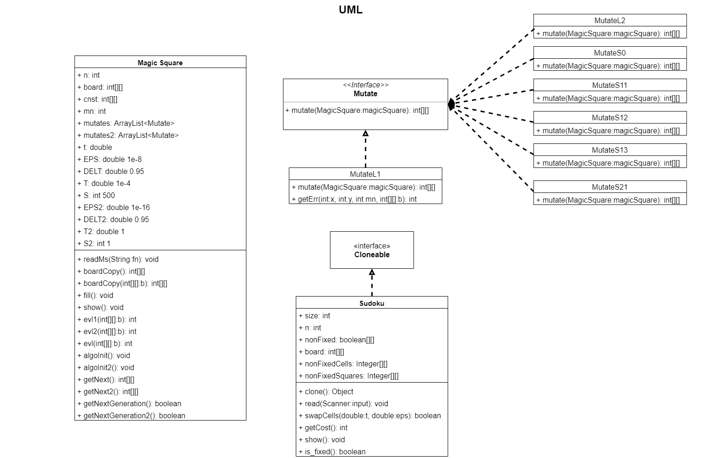

# CS209 Project Doc

**Project  Group**: 16

**Team members**: Li Yuanzhao, Xu Xinyu, Wu Shangxuan, Zhang Jiayi, Ren Yiwei, Jiang Yuchen

## Object-Oriented Design Doc

## Empirical results doc

As we improved our algorithm constantly, the time to solve Magic Square has been decrease a lot.

Here is time table of certain algorithm and certain size.

| Algorithm\Size      | 5 * 5 | 10 * 10 | 20 * 20 | 40 * 40 |
| ------------------- | ----- | ------- | ------- | ------- |
| Brute force         |       |         |         |         |
| Simulated Annealing |       |         |         |         |
| Final Algorithm     |       |         |         |         |

**Brute force**: Random generate 2-D array until it satisfies Magic Square requirements.

**Final Algorithm**: 