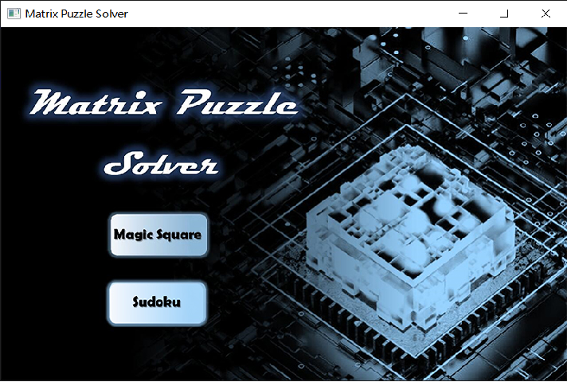
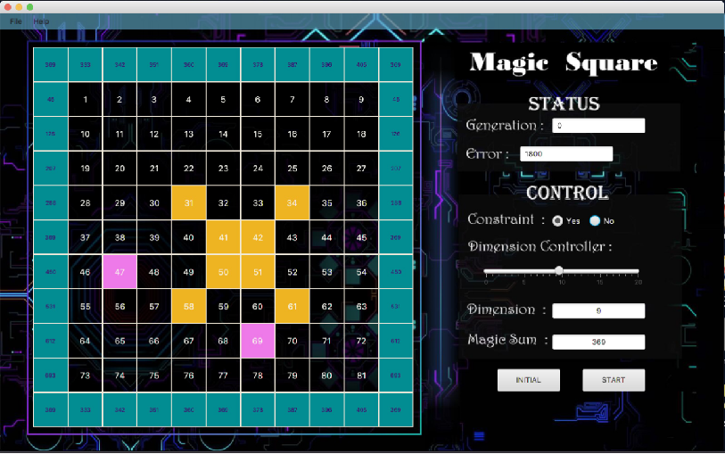
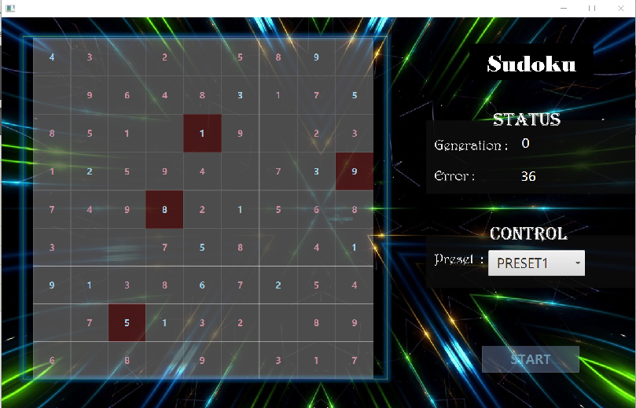

# CS209 Project OO Design Doc

**Project  Group**: 16

**Team members**: Li Yuanzhao, Xu Xinyu, Wu Shangxuan, Zhang Jiayi, Ren Yiwei, Jiang Yuchen

## Project Design

.png)

## Object oriented design

There are some details we want to explain to the UML graph.

### Status classes

The status classes are the class for store the runtime status. There are three status classes: `SquareProblem`, `MS`, and `SK`. 

#### SquareProblem

`SquareProblem` is an **abstract class**, which has the basic variables and methods for status storing and generating. 

#### MS

`MS` is a class for magic square status storing. MS is extends the `SquareProblem` class, and there are also some variables and methods for magic square problem. 

#### SK

`SK` is a class for sudoku status storing. `SK` is also extends the `SquareProblem`, but it is simpler than `MS`. The new variables and methods in `SK` is similar to `MS`. 

### Mutate functions

Our solver will use many mutate functions. To call the mutate functions more easier, we design a interface `MutateNew`, and all the mutate functions are wrapped by a class, such as `MutateNewS0`, `MutateNewS11`,  and implement the `MutateNew`. All the mutate functions will receive a MS object as parameter and return whether the new square be accept. 

## GUI Design

GUI is consist of three views: `RootWindow`, `Sudoku`, and `MagicSquare`

### RootWindow

In the `RootWindow`, we can left click to the buttons to choose to enter the `MagicSquare` or `Sudoku`

### MagicSquare

In `MagicSquare` view, user can drag to change the size of square. Using left click to two cells to swap the contents. Using right click can set a cell as constraint. `File` tool can save and load the square. The `pause` and `continue` during the runtime are supported

### Sudoku

In `Sudoku` view, user can set the value of each cell, or just select a preset square to start a game. If there are duplicate number in the same row, column or subsquare, these cells will trun to red.  `File` tool can save and load the square. The `pause` and `continue` during the runtime are supported.

