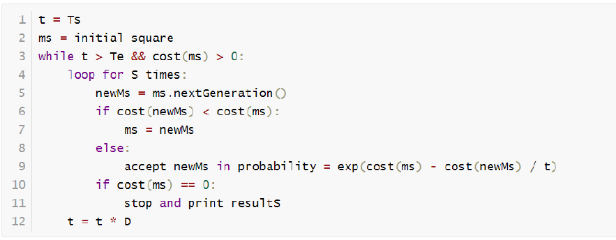

# Empirical results doc

## Algorithm

The algorithm we used in sudoku is a simple simulate annealing algorithm, and we use a hyper-heuristic method for magic square. 

### Magic Square

#### Simulate Annealing

For the magic square solver, we implement a simulate annealing algorithm with hyper-heuristic solver. The simulate annealing part is strengthen by *multiple try*. The pseudocode shows there



Where `Ts` is initial temperature, `Te` is ending temperature. `D` is delta, which can control the speed of annealing. S is times of multiple try. 

#### Hyper-heuristic

hyper heuristic is a thought to combined multiple heuristic function. There are two parts: high level heuristic (HLH) and low level heuristic (LLH)

##### HLH

The HLH we used is Random Permutation


## Result

### Magic Square

As we improved our algorithm constantly, the time to solve Magic Square has been decrease a lot.

Here is time table of result, each result are under 30 times runs (except the doubling test) .

| Result \ Size      | 5     | 10     | 15     | 20     | 40 (doubling test) |
| ------------------ | ----- | ------ | ------ | ------ | ------------------ |
| Average time       | 50 ms | 106 ms | 263 ms | 672 ms | \>= 10min          |
| standard deviation | 2 ms  | 62 ms  | 184 ms | 358 ms | \~                 |

More result details are in the [Appendix A](#Appendix A: 30 times result of magic square from 5 to 15 level) and [Appendix B](#Appendix B: result of 20 level magic square)

### Sudoku

The result of 3 level sudoku is

```
average time: 23ms 
std deviation: 2ms
```


# Appendix A: 30 times result of magic square from 5 to 15 level

### 5 level

```
54 53 48 49 52 49 49 49 51 53 50 52 46 50 52 56 49 53 51 48 51 48 53 53 50 53 52 55 52 46
tot: avg time: 50ms, std dev: 2.440628ms
```


### 10 level

```
122 164 114 145 95 85 76 109 131 63 71 64 94 82 76 75 134 76 83 116 105 82 77 81 68 84 410 147 77 102
tot: avg time: 106ms, std dev: 62.164263ms
```


### 15 level

```
688 197 149 543 234 254 146 103 665 680 162 205 208 150 118 200 125 617 275 102 240 259 174 485 87 98 177 153 213 186
tot: avg time: 263ms, std dev: 184.457285ms
```


# Appendix B: result of 20 level magic square

#### Experiment 1:

**Input with constraints:**

```java
 26   358   239     0     0     0     0     0     0     0     0     0     0     0     0     0     0     0     0     0
149   156   299     0     0     0     0     0     0     0     0     0     0     0     0     0     0     0     0     0
289   103   387     0     0     0     0     0     0     0     0     0     0     0     0     0     0     0     0     0
  0     0     0     0     0     0     0     0     0     0     0     0     0     0     0     0     0     0     0     0
  0     0     0     0     0     0     0     0     0     0     0     0     0     0     0     0     0     0     0     0
  0     0     0     0     0     0     0     0     0     0     0     0     0     0     0     0     0     0     0     0
  0     0     0     0     0     0     0     0     0     0     0     0     0     0     0     0     0     0     0     0
  0     0     0     0     0     0     0     0     0     0     0     0     0     0     0     0     0     0     0     0
  0     0     0     0     0     0     0     0     0     0     0     0     0     0     0     0     0     0     0     0
  0     0     0     0     0     0     0     0     0     0     0     0     0     0     0     0     0     0     0     0
  0     0     0     0     0     0     0     0     0     0     0     0     0     0     0     0     0     0     0     0
  0     0     0     0     0     0     0     0     0     0     0     0     0     0     0     0     0     0     0     0
  0     0     0     0     0     0     0     0     0     0     0     0     0     0     0     0     0     0     0     0
  0     0     0     0     0     0     0     0     0     0     0     0     0     0     0     0     0     0     0     0
  0     0     0     0     0     0     0     0     0     0     0     0     0     0     0     0     0     0     0     0
  0     0     0     0     0     0     0     0     0     0     0     0     0     0     0     0     0     0     0     0
  0     0     0     0     0     0     0     0     0     0     0     0     0     0     0     0     0     0     0     0
  0     0     0     0     0     0     0     0     0     0     0     0     0     0     0     0     0     0     0     0
  0     0     0     0     0     0     0     0     0     0     0     0     0     0     0     0     0     0     0     0
  0     0     0     0     0     0     0     0     0     0     0     0     0     0     0     0     0     0     0     0
```


**Running time for 30 times:**

**Total time (ms):**

```java
900 741 1093 406 742 1170 762 228 1092 348 689 390 385 482 814 1486 1174 1154 203 372 1224 976 270 716 361 384 260 523 230 598
```

**Average: 672 ms Std dev: 358.361706ms**

**One of the answers:**

```java
 26   358   239     1    53   130    86   144   377   356   145   282   234   277   154   168   349   214    93   324
149   156   299    79   177   391    77     7   301   169   265     5   165   269   230    96   280   334   276   285
289   103   387   300   245   233    13    80   362   178    61    37   325   201   347   121    49    54   284   341
272   252   321   264    10   370   134   337   101    59   328   373   131   200    22   385   310     9    18   114
327    25    46   273   166   318   357   176   226   348   129   120    60    65   141   126   260   292   174   381
237    57   294   143   392   287    84   218   108   159   196   304    95   283   185   244   306   158   128   132
188   198    24   229   342   208   173   330   336   320   193   146   135    44   228   241   268     3    97   307
339   102   352    74   371   333   147   258    42   217   293    88    85   175   397    58   137    89   254   199
290   345   115   314   393    82   375   104    47   140   296   142    66   374   124   247   255   183    75    43
 90   106   235   389    33   261   361   266   253   192   105   311    32    83   133   312   238    72   388   150
202   122   113   259   187    63   110    99   209    39   221   335   298   267   243   394    52   189   305   303
 34    30   354   249   270   127   225   322   151   167   181   378   288   316     4   302    12   355   172    73
 50   119    64   246   203   111   186   309   248   227   251    16   152   395   220    81   338   332   350   112
274   263    41   163   326   107   343    15   223    94   360   353   139    38   155   219   364   231    87   215
182   138   180   262    11    51   382   271   117    78   123    35   386   100   351   372     8   396   236   331
194   398   384    55   317     6   216   197   162    27    23   399   291   204   171     2    69   275   363   257
 20   232    92   367    70   346   379   242   164   376   125    56   344   210    98    36   184   161   390   118
160   359   136    62   205    76   157    31   195   365   400   380   212   211   383    67   207   340    19    45
319   278    21    91   222   213    14   281   109   329   286    71   366    48   308   315   256   295   148    40
368   369   313   190    17   297   191   323   279   170    29   179   206   250   116   224    68    28   153   240
```


#### Experiment 2:

**Input with constraints:**

```java
0     0     0     0     0     0     0     0     0     0     0     0     0     0     0     0     0     0     0     0
0     0     0     0     0     0     0     0     0     0     0     0     0     0     0     0     0     0     0     0
0     0     0     0     0     0     0     0     0     0     0     0     0     0     0     0     0     0     0     0
0     0     0     0     0     0     0     0     0     0     0     0     0     0     0     0     0     0     0     0
0     0     0     0     0     0     0     0     0     0     0     0     0     0     0     0     0     0     0     0
0     0     0     0     0     0     0     0     0     0     0     0     0     0     0     0     0     0     0     0
0     0     0     0     0     0     0     0     0     0     0     0     0     0     0     0     0     0     0     0
0     0     0     0     0     0     0     0     0     0     0     0     0     0     0     0     0     0     0     0
0     0     0     0     0     0     0     0     0     0     0     0     0     0     0     0     0     0     0     0
0     0     0     0     0     0     0     0     0     0     0     0     0     0     0     0     0     0     0     0
0     0     0     0     0     0     0     0     0     0     0     0     0     0     0     0     0     0     0     0
0     0     0     0     0     0     0     0     0     0     0     0     0     0     0     0     0     0     0     0
0     0     0     0     0     0     0     0     0     0     0     0     0     0     0     0     0     0     0     0
0     0     0     0     0     0     0     0     0     0     0     0     0     0     0     0     0     0     0     0
0     0     0     0     0     0     0     0     0     0     0     0     0     0     0     0     0     0     0     0
0     0     0     0     0     0     0     0     0     0     0   399   291   204     0     0     0     0     0     0
0     0     0     0     0     0     0     0     0     0     0    56   344   210     0     0     0     0     0     0
0     0     0     0     0     0     0     0     0     0     0   380   212   211     0     0     0     0     0     0
0     0     0     0     0     0     0     0     0     0     0     0     0     0     0     0     0     0     0     0
0     0     0     0     0     0     0     0     0     0     0     0     0     0     0     0     0     0     0     0
```


**Running time for 30 times:**

**Total time (ms):**

```java
382 473 363 811 557 592 527 403 811 1752 487 900 2878 1040 600 929 818 669 324 298 713 616 1567 302 848 1108 1387 1421 660 1744 
```

**Average: 866 ms Std dev: 554.831206 ms**

**One of the answer:**

```java
228   164   388   278   310   156   127    86    49   199   276   325   375    91   390   120   116   115    66   151
288    88   252   209   361   150    26    20    69   273   393   259   349   160   167   133   141   341   300    31
 73   330   129   335   283   208   277   161   207     8   323   118    68   251   102   197   366   352    38   184
305   180   174   155    67   285   236    28    47   200   267   203   117    64   387    96   238   340   319   302
217    54   242   244   113   220   172   367    16   357    83   301   130   166   360    34   358    76   213   287
270   395   241    17    29   332   230   235   321    59   234    94   100   163   296   233   374   112     4   271
202   372   173   356    58    93   336   186   196    51    70   214   189   114   378   237   298    99   182   206
231   247   324    90   250    87    43   338   359    14    23   351    15   346   152   376    48   284   239   193
137   392   176   111    40   343   260   314   121   290   258   126   255     1   124    78   386   322     2   274
139    33    45   299   195    46   316   179   201   373   355   286   216   190   171   185    71   110   377   223
123   369   107    44     6    98   385   394   354   253   280    18     7   368    85    81   192   308   218   320
262    27   198   304   147   144    13   149    89   272   181   101   165   318   135   353   266   329   311   246
128   281   227    11   342   370   303   381   226    21   269   334    36   384    80    37   364   108     3   105
261    97    41   297   398   143   337   131   240   245   382   142   292    62   162   268    63   397    22    30
317    95   177   312   307   327   159   248   328   225    53   103   224   345    92    84    25   146   104   339
 35    61   205   178   109   168   204   294   187   170    42   249   399   389   289   313   221    72   291   134
257   279   263     5    57   188   210   148   371   293   122   391    56   106   295   157   194   136   344   138
363    75   333   132   243   169   211   154   222   309    10    60   380    32   256   396    79   229   212   145
119   140    50   379   347   219    12   158   175   215   315   326   362    77    24   350    19    52   365   306
 55   331   265   254   348   264   153    39   232   183    74     9   275   383    65   282   191    82   400   125
```


